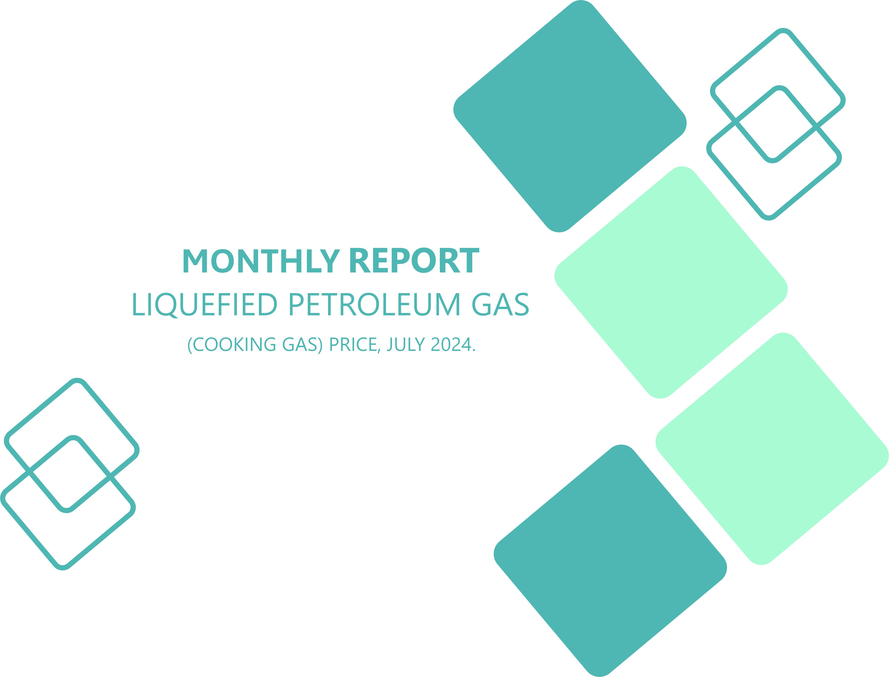
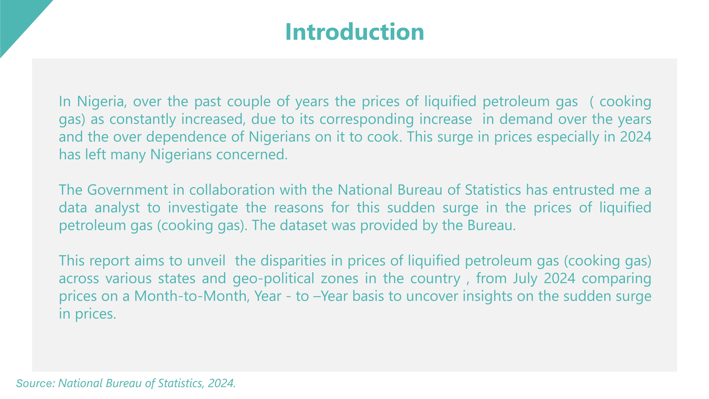
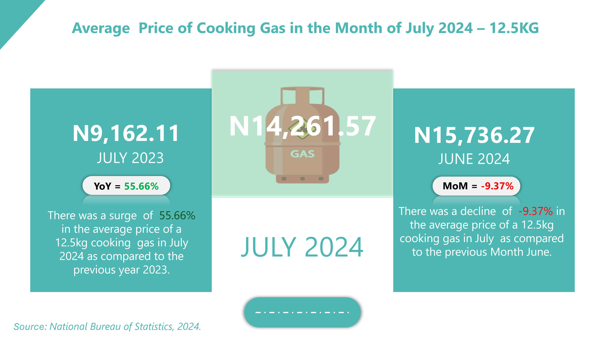
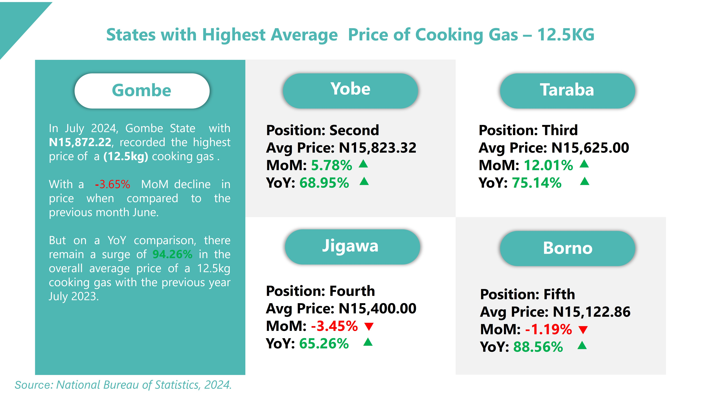
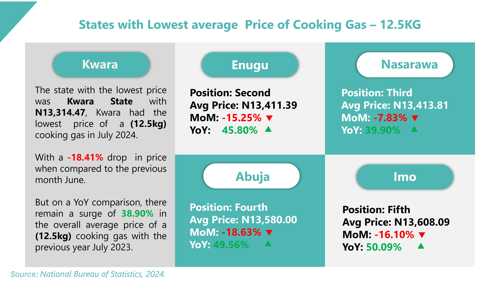
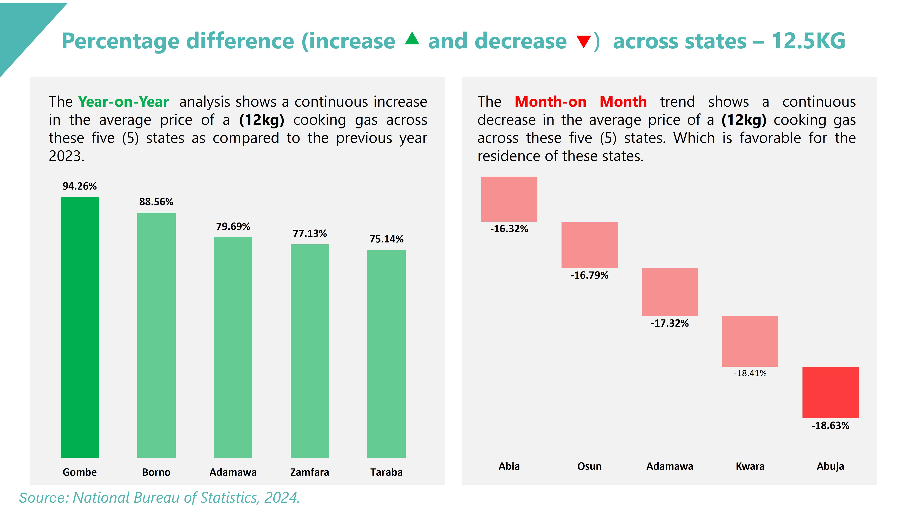
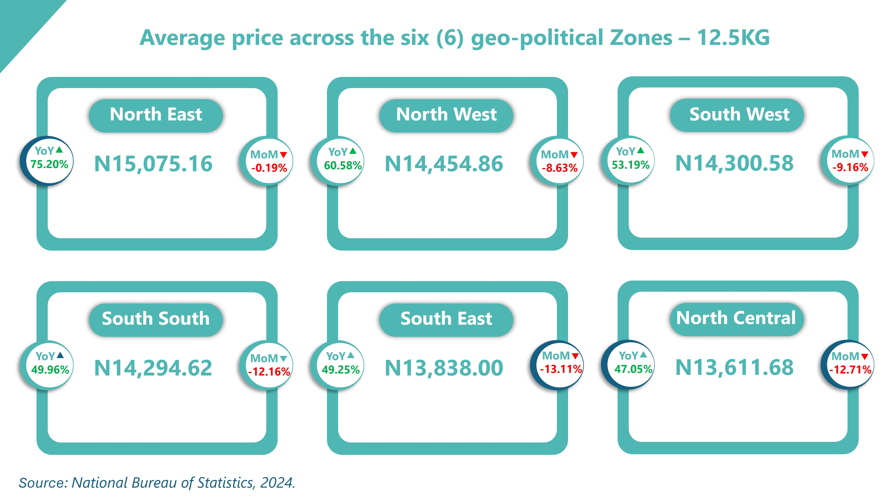

# 12.5kg Liquefied Petroleum Gas (LPG) Price Analysis – July 2024  
---
### This project presents an Excel and PowerPoint-based analysis of the average cost of refilling a 12.5kg Liquefied Petroleum Gas (cooking gas) cylinder in Nigeria as of July 2024.  

---
## Introduction  

---
## Aims & Objective  

---
## Data Sources  

---
## Analysis & Calculation  

---
### Average Price of 12.5kg Cooking Gas in the Month of July 2024  

---
### States with the Highest Average Price of 12.5kg Cooking Gas  

---
### States with the Lowest Average Price of 12.5kg Cooking Gas  

---
### Percentage Difference in Prices of 12.5kg Cooking Gas Across States  

---
## Average price of Cooking Gas- 12.5kg across the six (6) geo-political Zones

---
## Summary  

---
## Salutation 

---
## About Me  
